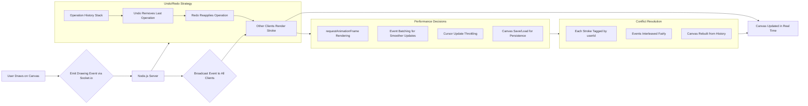

# Collaborative Drawing App — Architecture Overview

## 1. Data Flow Diagram

## 2. WebSocket Protocol

The app uses **Socket.io** for low-latency, bi-directional event communication.
Below is a summary of all events exchanged between client and server.

| Direction        | Event Name        | Payload                         | Description                                             |
| ---------------- | ----------------- | ------------------------------- | ------------------------------------------------------- |
| Client → Server  | `draw`            | `{ from, to, color, width }`    | Sent whenever a user draws a segment                    |
| Server → Clients | `draw`            | Same payload                    | Broadcast to all connected clients to render the stroke |
| Client → Server  | `cursor`          | `{ x, y, username, color }`     | Cursor movement data for live indicators                |
| Server → Clients | `cursor`          | `{ id, x, y, username, color }` | Distributed cursor info for all users                   |
| Client → Server  | `undo` / `redo`   | None                            | Triggers global undo/redo                               |
| Server → Clients | `sync-history`    | `[ ...strokes ]`                | Broadcasts updated stroke history                       |
| Client → Server  | `set-name`        | `{ name }`                      | Sets username for UI                                    |
| Server → Clients | `user-list`       | `[ { id, name, color } ]`       | Updates the online users list                           |
| Server → Clients | `user-disconnect` | `{ id }`                        | Removes user cursor and name on disconnect              |

## 3. Undo/Redo Strategy

Undo and redo operations are handled **globally**, ensuring that all connected users see the same canvas state.

* **History Stack:**
  Every stroke is stored in an array (`history`).

* **Undo:**
  Removes the most recent stroke from `history` and moves it into an `undone` stack.
  The server then emits `sync-history` to all clients.

* **Redo:**
  Pops a stroke from `undone` and pushes it back to `history`.
  The server emits `sync-history` again for synchronization.

This design guarantees that the canvas state is consistent across all connected clients, regardless of who initiated the undo/redo.

## 4. Performance Decisions

The following optimizations were implemented for smooth, real-time interaction:

* **requestAnimationFrame:**
  Cursor and performance metrics update at the browser’s refresh rate.

* **Event Throttling:**
  Cursor events are reduced in frequency to minimize network overhead.

* **Efficient Repainting:**
  Only incremental changes are drawn instead of redrawing the entire canvas.

* **Local ImageData Cache:**
  Canvas content is preserved on resize and during undo/redo operations.

* **Lightweight Persistence:**
  Save/Load feature serializes strokes to JSON and allows reloading without server storage.

## 5. Conflict Resolution

* Each drawing event is tagged with the user’s unique socket ID.
* There is **no locking mechanism** — users can freely draw simultaneously.
  Overlapping strokes are simply layered in the order they arrive.
* The authoritative state is always the server’s `history` array.
  Whenever a user reconnects, their canvas is rebuilt from this shared history.
* This approach ensures consistency while keeping latency extremely low.

---

